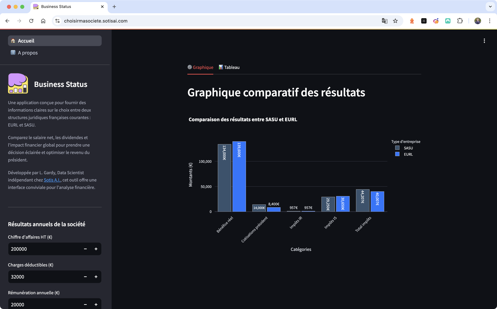

# Business Status: SASU vs EURL

## 📄 Description

💼 Discover an application dedicated to comparing salaries and financial outcomes between two common French legal structures: SASU and EURL.

🤔 “Which legal structure will provide a better net salary?” This application helps answer this question by providing detailed simulations and graphical visualizations of net salaries, dividends, and overall financial impacts for both SASU and EURL.

Here's a tool that allows you to analyze and optimize your financial decisions based on various parameters like annual turnover, deductible expenses, and dividend distribution. It's ideal for entrepreneurs and business owners who need to make informed decisions about their company's legal structure.

🌐 Access the app and start your analysis now at [https://choisirmasociete.sotisai.com](https://choisirmasociete.sotisai.com).



---

## ⚙️ Setup & Usage

You can run the application in two ways:

- **Locally using `uv`**
- **Using Docker Compose**

### 🔧 Option 1 — Run Locally with `uv`

> `uv` is a fast and modern Python tool that handles virtual environments and dependencies via `pyproject.toml`.

1. **Install `uv`** (if not already installed)  
   ```bash
   curl -Ls https://astral.sh/uv/install.sh | sh
   ```

2. **Clone the repository**  
   ```bash
   git clone https://github.com/LudovicGardy/app_name
   cd app_folder/
   ```

3. **Create and activate the environment**  
   ```bash
   uv venv
   ```

   - On **macOS/Linux**:
     ```bash
     source .venv/bin/activate
     ```

   - On **Windows** (PowerShell):
     ```powershell
     .venv\Scripts\Activate.ps1
     ```

4. **(Optional) If the virtual environment doesn't behave properly**

   Sometimes, on macOS in particular, the environment might be missing some tooling (like `pip`). You can try the following fixes:

   ```bash
   .venv/bin/python -m ensurepip --upgrade
   .venv/bin/python -m pip install --upgrade pip
   # Optional: Only if you need to use Jupyter notebooks
   .venv/bin/python -m pip install ipykernel -U --force-reinstall
   ```

5. **Launch the app**  
   ```bash
   streamlit run main.py
   ```

### 🐳 Option 2 — Run with Docker Compose

1. **Make sure Docker and Docker Compose are installed and running**

2. **Go to the project directory**
   ```bash
   cd path/to/app_folder
   ```

3. **Build and start the app**
   ```bash
   docker-compose up --build
   ```

4. **Access the app**
   Open your browser at: [http://localhost:8502](http://localhost:8502)

---

## 🛠️ Development

### Pre-commit Hooks

This project uses pre-commit to maintain code quality. The following hooks are configured:

- **Basic hooks**: checking for trailing whitespaces, end-of-file formatting, YAML and TOML file verification, etc.
- **Ruff**: Python code linting and formatting
- **Codespell**: spell checking
- **Commitizen**: checking commit messages according to the defined convention

To install pre-commit:

```bash
# Install dependencies
uv pip install pre-commit ruff

# Install git hooks
pre-commit install
```

The hooks will run automatically with each commit. You can also run them manually:

```bash
pre-commit run --all-files  # Run on all files
pre-commit run ruff         # Run a specific hook
```

Ruff configuration is defined in `pyproject.toml` and includes:
- reStructuredText docstring format
- Import checking
- Double quote formatting
- Line length limited to 100 characters

---

## 👤 Author
- LinkedIn: [Ludovic Gardy](https://www.linkedin.com/in/ludovic-gardy/)
- Website: [https://www.sotisai.com](https://www.sotisai.com)
